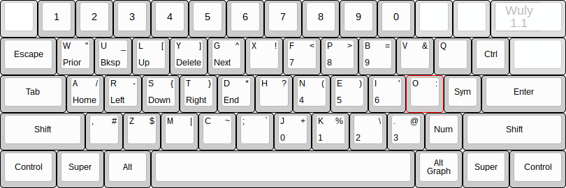

### Disclaimer
Actually, the only reason this keyboard layout exists is because I did not want to learn a new home row from Colemak, and I really liked Antibracket's symbols. Warning advised.

# The WULY Antimak

An ergonomic modifier based keyboard layout with Antibracket's symbols and numbers and a home row practically stolen from Colemak. Also focuses around ease of vimming and still optimised for the English language... so basically it's crack for your keyboard.

Also take note how easy it is to type `ls` and `cd`.

## Installation & Testing

### Linux

To test:

    git clone https://github.com/jackrosenthal/wuly-antimak && xkbcomp -I$PWD/wuly-antimak/xkb wuly-antimak/xkb/test.xkb $DISPLAY

To install:

    git clone https://github.com/jackrosenthal/wuly-antimak && sudo bash wuly-antimak/linux/install.sh

### Windows

Currently there is only an AHK script, but you don't need admin rights. Perfect for when you need to
hop on a public computer.

To use it, download windows/bin/wuly.exe from this repo and run it. Press both the left and right alt
keys to exit.

If you are using your own computer, you may want to have it run at startup (not sure how to do that.)
